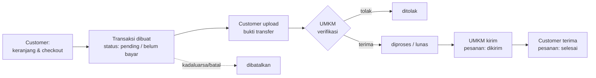
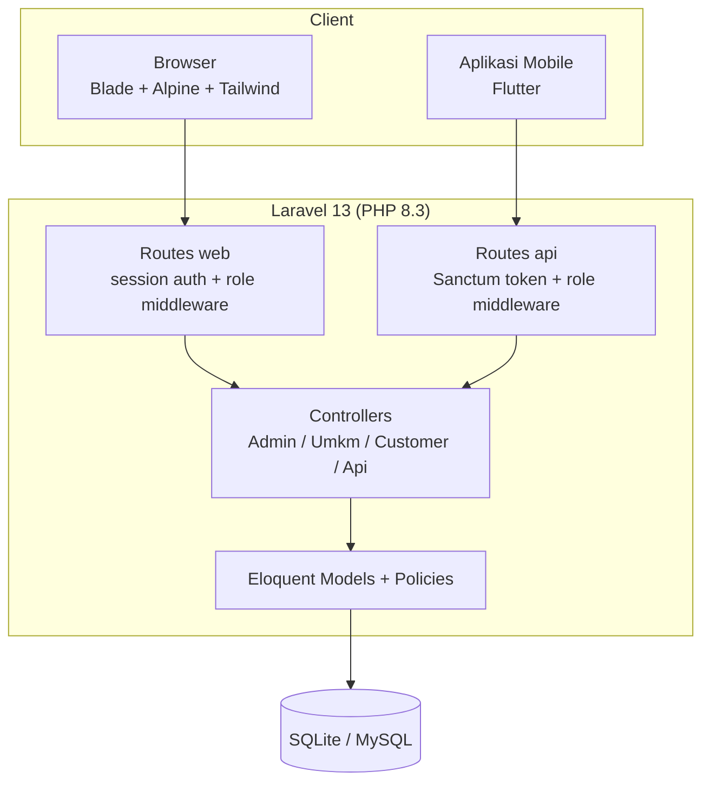

# IBC Store — ERP & Marketplace UMKM

Aplikasi ERP sekaligus direktori toko untuk UMKM binaan Inkubator Bisnis Center (IBC). Dibangun dengan Laravel 13, mencakup katalog publik, transaksi dengan verifikasi pembayaran manual, pembukuan keuangan, laporan, serta analitik & prediksi bisnis. Tersedia juga REST API (Sanctum) untuk aplikasi mobile.

## Fitur

- **Katalog publik** — direktori toko UMKM dan produk, bisa diakses tanpa login
- **Multi-role** — `admin` (kelola master data, user, UMKM), `umkm` (kelola toko sendiri), `customer` (belanja)
- **Transaksi** — keranjang → checkout per toko → upload bukti transfer → verifikasi oleh UMKM → kirim → diterima
- **Keuangan UMKM** — pencatatan saldo/modal, pengeluaran, dan transaksi keuangan otomatis
- **Laporan** — laba rugi, pendapatan, perubahan modal; ekspor PDF (dompdf) dan Excel (maatwebsite/excel)
- **Analitik & prediksi** — tren penjualan, produk terlaris, pelanggan; prediksi omzet, stok habis, dan produk trending (php-ml)
- **REST API** — endpoint untuk customer & UMKM dengan otentikasi Laravel Sanctum, terdokumentasi via Swagger (l5-swagger)

## Alur Sistem

### Alur transaksi (inti)



### Arsitektur



## Quick Start

### Prasyarat

- PHP ≥ 8.3 (ekstensi: sqlite3, gd, zip)
- Composer
- Node.js ≥ 20 + npm

### Instalasi

```bash
# 1. Clone dan pasang dependensi
git clone https://github.com/s4nj4y/erp.git ibc-laravel
cd ibc-laravel
composer install
npm install

# 2. Konfigurasi environment
cp .env.example .env
php artisan key:generate

# 3. Siapkan database (default: SQLite, tanpa setup server)
touch database/database.sqlite
php artisan migrate --seed

# 4. Build aset frontend
npm run build

# 5. Jalankan
php artisan serve
```

Buka `http://localhost:8000`. Seeder membuat data demo (UMKM dan produk contoh) beserta tiga akun — password semuanya `password`:

| Role | Email |
|---|---|
| Admin | `admin@ibc.test` |
| UMKM | `umkm@ibc.test` |
| Customer | `customer@ibc.test` |

💡 Untuk pengembangan, jalankan `npm run dev` (Vite HMR) berdampingan dengan `php artisan serve`.

### Verifikasi

```bash
php artisan test
```

Seluruh 168 tes harus hijau (423 assertion).

## Konfigurasi

Semua konfigurasi lewat `.env`. Item yang relevan untuk proyek ini:

| Variabel | Wajib | Keterangan |
|---|---|---|
| `APP_KEY` | ✅ | Dibuat otomatis oleh `php artisan key:generate` |
| `APP_URL` | ✅ | URL dasar aplikasi, mis. `http://localhost:8000` |
| `DB_CONNECTION` | ✅ | Default `sqlite`; ganti ke `mysql` + isi `DB_HOST/DB_DATABASE/DB_USERNAME/DB_PASSWORD` untuk produksi |
| `L5_SWAGGER_CONST_HOST` | ⬜ | Host yang tampil di dokumentasi Swagger (default `http://localhost:8000`) |
| `SESSION_DRIVER`, `QUEUE_CONNECTION`, `CACHE_STORE` | ⬜ | Default `database`, tidak perlu diubah untuk lokal |

⚠️ Jangan pernah commit file `.env`.

## REST API

- Base URL: `/api`
- Otentikasi: Bearer token (Sanctum) via `POST /api/login` atau `POST /api/register`
- Dokumentasi interaktif: `php artisan l5-swagger:generate` lalu buka `/api/documentation`

Contoh:

```bash
# Login
curl -X POST http://localhost:8000/api/login \
  -H "Content-Type: application/json" \
  -d '{"email":"user@example.com","password":"password"}'

# Daftar produk (publik)
curl http://localhost:8000/api/produk

# Dashboard UMKM (butuh token role umkm)
curl http://localhost:8000/api/umkm/dashboard -H "Authorization: Bearer <token>"
```

Grup endpoint: publik (`/toko`, `/produk`), `/master/*` (data referensi), `/umkm/*` (produk, stok, transaksi, saldo, pengeluaran, analitik, prediksi, laporan), dan customer (`/keranjang`, `/checkout`, `/transaksi`).

## Perintah Umum

```bash
php artisan serve              # jalankan server dev
npm run dev                    # Vite dev server (HMR)
npm run build                  # build aset produksi
php artisan test               # jalankan seluruh tes
php artisan migrate:fresh --seed   # reset database + data demo
php artisan l5-swagger:generate    # regenerasi dokumentasi API
vendor/bin/pint                # format kode (Laravel Pint)
```

## Tech Stack

| Lapisan | Teknologi |
|---|---|
| Backend | Laravel 13, PHP 8.3 |
| Auth | Laravel Breeze (web/session), Sanctum (API token) |
| Frontend | Blade, Alpine.js, Tailwind CSS, Vite, Chart.js |
| Database | SQLite (default) / MySQL |
| Laporan | barryvdh/laravel-dompdf (PDF), maatwebsite/excel (Excel) |
| Prediksi | php-ai/php-ml (regresi untuk prediksi omzet/stok/trending) |
| Dokumentasi API | darkaonline/l5-swagger |
| Testing | PHPUnit 12 (168 tes) |

## Struktur Proyek

```
app/
├── Http/Controllers/
│   ├── Admin/        # dashboard, master data, kelola UMKM & produk
│   ├── Umkm/         # produk, stok, transaksi, keuangan, laporan, analitik
│   ├── Customer/     # keranjang, checkout, transaksi
│   └── Api/          # mitra REST API dari controller di atas
├── Models/           # Umkm, Produk, Transaksi, Saldo, dst.
routes/
├── web.php           # rute web per role (middleware auth + role)
└── api.php           # rute API (Sanctum)
database/
├── migrations/       # skema domain di satu migrasi utama
└── seeders/          # data demo UMKM & produk
tests/                # Feature & Unit (168 tes)
```

## Catatan Penting

- Verifikasi pembayaran **manual**: customer transfer ke rekening UMKM lalu upload bukti; tidak ada payment gateway.
- Checkout dilakukan **per toko** — keranjang lintas UMKM dipecah per checkout.
- Otorisasi memakai Laravel Policy: UMKM hanya bisa mengelola data toko miliknya sendiri.

## Lisensi

MIT
